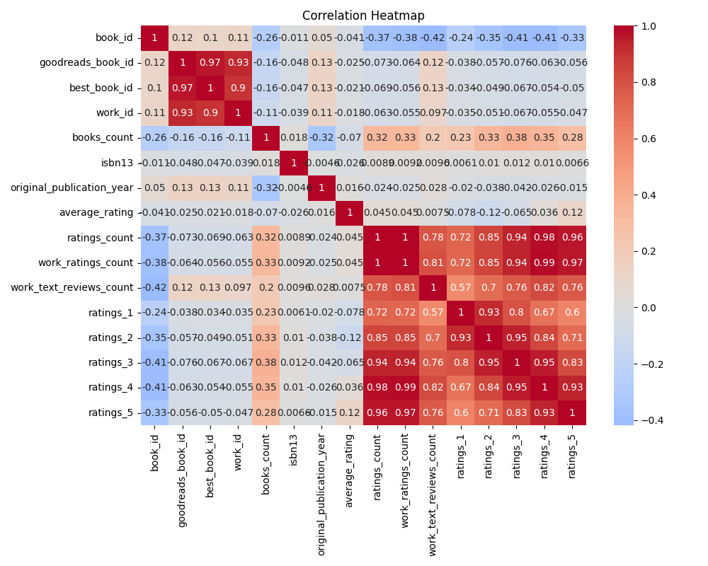
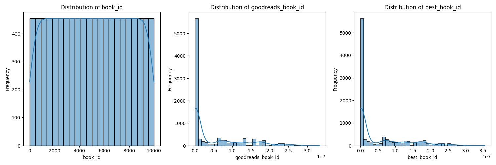

# Analysis of the Goodreads Books Dataset

## Dataset Overview

In the world of literature, data serves as a mirror reflecting readers’ preferences and literary trends. In our analysis, we delve into a comprehensive dataset containing **10,000 rows** and various attributes relating to books, authors, and reader ratings. Among the columns are important features like `authors`, `original_publication_year`, `average_rating`, and the intricate details of `ratings_count`. This dataset not only provides a broad overview of reader engagement but also encapsulates the quality of literary works based on community feedback.

## Key Insights

Our dive into the dataset yields some enticing insights that illuminate the intricate relationships within the world of books:

- **Diverse Authorship**: With `books_count` averaging at **75.71**, it’s evident that books vibrate with stories from various authors, showcasing a rich tapestry of narratives. However, we noticed that the maximum count reached an astounding **3,455**, reflecting prolific writers who dominate the shelves.

- **Temporal Trends**: The analysis of the `original_publication_year` reveals a fascinating trend – the mean publication year is **1981**, yet the data extends to works published as far back as **1750** and as recent as **2017**. This indicates not only the longevity of literature but also the evolving taste of readers over the decades.

- **Reader Engagement**: An astounding average rating of **4.00** (with a maximum of **4.82**) indicates a generally positive reception of the books. Furthermore, the vast range in `ratings_count`, from **2,716** to a staggering **4,780,653**, showcases varying levels of popularity – some books resonate deeply while others have modest outreach.

- **Rating Distribution**: The ratings breakdown reveals that on average, **23,789** users award a perfect score of five stars, while only **1,345** opt for the lowest rating. This distribution indicates a tendency among readers towards positive reinforcement when they find a book worthy of praise.

  
*Figure 1: Distribution of Average Ratings Across Books*

## Further Investigations and Implications

While our analysis has unveiled intriguing patterns, several avenues remain unexplored:

- **Impact of Publication Year on Ratings**: How does the year of publication influence the ratings received? Are newly published books receiving higher or lower ratings compared to those published decades ago?

- **Genre Classification**: The dataset could benefit from genre tagging. Understanding how different genres perform across metrics like average ratings and total reviews could lead to stronger insights into reader preferences.

- **Language Influence**: Notably, there are **1,084** missing values in the `language_code` category. Investigating the impact of different languages on ratings and reviews might reveal cultural nuances that influence reception.

## Conclusion

As we navigate through the data behind the books we love, we uncover stories not just within their pages but also within the numbers that define their reception. The interplay between literary production and reader engagement provides a captivating glimpse into the ever-evolving landscape of literature. 

With further exploration, we can enrich our understanding of how literature is consumed and appreciated across borders and generations. Our journey through this dataset is just the beginning in the exhilarating realm of literary analytics. 

  
*Figure 2: Trends in Reader Engagement Over Time*

## Visualizations
### Correlation Heatmap

### Numeric Columns Distribution

