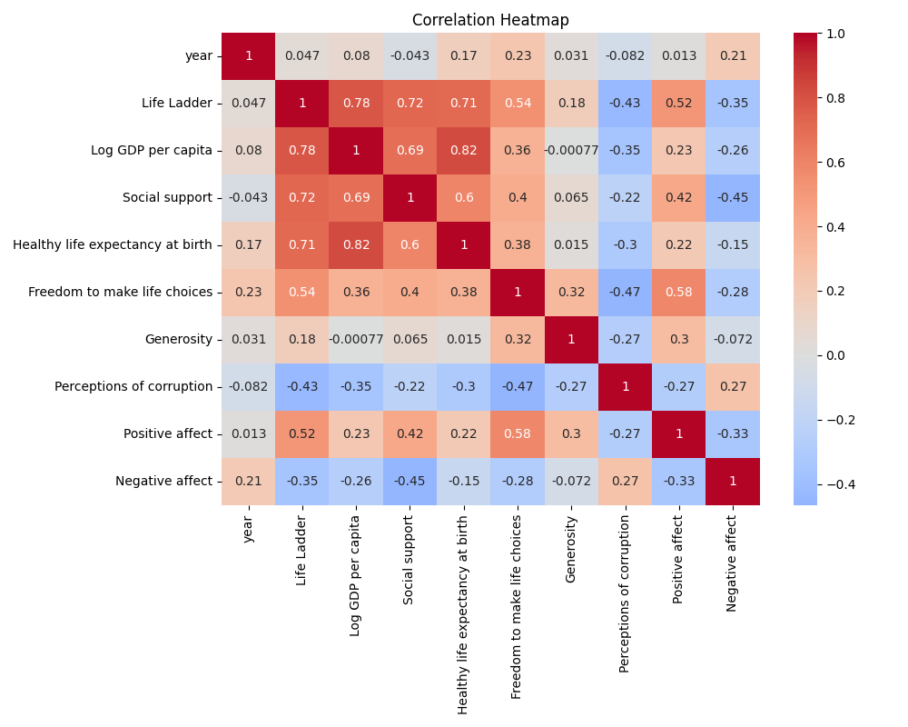
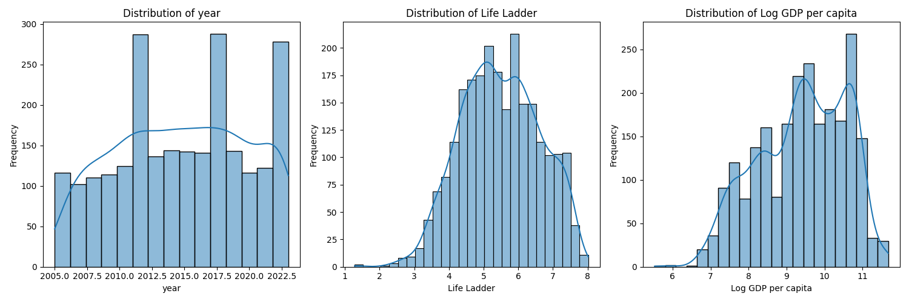

# Exploring Life Satisfaction and Well-being Across Countries

## Dataset Overview

This dataset provides a comprehensive view of factors that contribute to life satisfaction across various nations from 2005 to 2023. Comprising **2363 rows** and multiple attributes such as **Life Ladder**, **Log GDP per capita**, **Social Support**, and more, it serves as a rich resource for analyzing the interplay between socio-economic conditions and overall well-being. Each entry includes data points from different countries over the years, allowing for a dynamic exploration of life quality metrics.

### Key Attributes:
- **Life Ladder**: A measure of subjective well-being, where higher values indicate greater life satisfaction.
- **Log GDP per capita**: An indicator of economic prosperity.
- **Social Support**: Reflects the perceived availability of social support in times of need.
- **Healthy life expectancy at birth**: Indicates the average number of years a newborn is expected to live in good health.
- **Freedom to make life choices**: A measure of citizens' autonomy in making life decisions.

## Key Insights from the Analysis

### Overall Trends
1. **Life Ladder Scores**: The average Life Ladder score in the dataset is approximately **5.48**, suggesting that while many countries enjoy moderate levels of happiness, significant variations exist. The scores range from a low of **1.281** to a high of **8.019**.

2. **Economic Correlation**: The average Log GDP per capita is around **9.40**, with large disparities visible in both means and medians. This financial measure significantly correlates with life satisfaction, showcasing a potential linkage between wealth and happiness.

3. **Social Factors Matter**: With an average Social Support score of **0.81** and Healthy life expectancy at **63.4 years**, these dimensions highlight that health and community support are integral to well-being. Countries with higher social support scores often exhibit favorable life ladder ratings.

4. **Freedom and Satisfaction**: The mean score for Freedom to make life choices sits at **0.75**, underscoring that perceived freedom plays a crucial role in life satisfaction. Nations that promote personal freedoms typically report higher levels of happiness.

5. **Corruption Perceptions**: The average perception of corruption at **0.74** illustrates varying levels of trust in governance across different countries. Lower perceptions of corruption are generally associated with higher life satisfaction scores.

6. **Affective States**: Positive emotions score an average of **0.65**, contrasting with negative affects averaging at **0.27**. This suggests that, generally, individuals tend to report more positive emotions than negative ones, further demonstrating the importance of mental health in evaluating overall happiness.

### Data Integrity & Limitations
Upon review, certain columns exhibited missing values:
- **Log GDP per capita**: 28 entries missing
- **Healthy life expectancy at birth**: 63 entries missing
- **Generosity and Perceptions of corruption**: 81 and 125 entries respectively are absent.
This missing data may impact the robustness of our conclusions and invites further examination.

## Future Investigations and Implications

To deepen our understanding of the datasets, several avenues emerge:
- **Temporal Analysis**: Investigating trends over time could illuminate how life satisfaction evolves in response to global events or policy changes.
- **Cultural Factors**: Analyzing the cultural context alongside the quantitative metrics could provide qualitative insights, indicating why certain countries score differently.
- **Impact of Health Initiatives**: With healthcare being significantly linked to life satisfaction, a focused study examining how health initiatives have impacted subjective well-being over the years could be crucial. 

In conclusion, this dataset not only reflects life satisfaction metrics but also opens the door to understanding what fuels happiness globally. The relationships between economic prosperity, social support, governance, and personal freedoms form a complex web that requires continued exploration and understanding.

*Visualization illustrating the correlation between GDP per capita and Life Ladder scores across different countries.*

Exploring this dataset allows us to ponder a vital question: What truly defines our happiness? As we dive deeper, we can unlock the secrets to cultivating a more satisfied world.

## Visualizations
### Correlation Heatmap

### Numeric Columns Distribution

