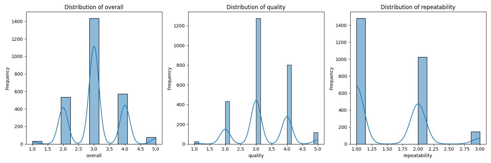

# Analysis of Dataset: Understanding Ratings and Quality

## Dataset Description

In this dataset, we have a collection of 2,652 entries characterized by several features, including `date`, `language`, `type`, `title`, `by`, `overall`, `quality`, and `repeatability`. These features provide valuable insights into various items rated by users across potentially diverse contexts. The three numerical columns—`overall`, `quality`, and `repeatability`—indicate ratings given by users on a scale from 1 to 5 for the first two, and 1 to 3 for the latter.

The dataset captures user interaction over time, but does contain some missing values that we should be mindful of as they could affect the validity of our conclusions. In particular, there are 99 missing entries for the `date` column and a significant number of missing ratings for the `by` column, where 262 entries are unaccounted for.

## Key Insights from the Analysis

### Distribution of Ratings

The analysis of the numeric columns reveals some intriguing insights:

- **Overall Ratings**:  
  Mean: 3.05 | Median: 3.0 | Min: 1.0 | Max: 5.0  
  The ratings tend to hover around the midpoint of the scale, suggesting a moderately positive reception among users. 

- **Quality Ratings**:  
  Mean: 3.21 | Median: 3.0 | Min: 1.0 | Max: 5.0  
  Similar to overall ratings, quality ratings echo this sentiment but slightly edge higher, suggesting that users tend to rate the quality of items more favorably.

- **Repeatability Ratings**:  
  Mean: 1.49 | Median: 1.0 | Min: 1.0 | Max: 3.0  
  Here, the ratings are notably lower. A mean below 2 implies that the items are not frequently revisited or recommended, reflecting potential concerns about value retention or satisfaction post-use.

### Visualization Insights

To further illuminate these findings, we can visualize the distributions across ratings:

Here, the histogram clearly shows the clustering of overall and quality ratings around the median, while the repeatability metrics reveal a stark difference, with a significant concentration at the minimum rating.

### Missing Data Clarity

The presence of missing entries, particularly in the `date` and `by` columns, stands out. Understanding the implications of these gaps will be important in refining our conclusions and future studies.

## Suggestions for Further Investigations

Given these insights, there are several paths we could pursue:

1. **Investigate Missing Data**: Exploring the reasons behind the missing values in the `date` and `by` columns may lead to richer insights regarding user engagement or demographic trends.

2. **Correlation Analysis**: Diving deeper into the relationship between `overall`, `quality`, and `repeatability` ratings may uncover factors that contribute to user satisfaction and perceived item value.

3. **Temporal Analysis**: Analyzing how user ratings over time correlate with external factors (e.g., trends, marketing campaigns) could yield insights into potential strategies for improving repeatability and quality perceptions.

4. **User Segmentation**: Examining how ratings differ by language or type could reveal divergent user experiences, helping tailor offerings to specific audiences.

## Conclusion

This dataset provides a fascinating snapshot of user ratings across diverse dimensions. By continuing to explore these insights and addressing questions related to the missing data, we lay the groundwork for deeper understanding and greater impact on user engagement strategies. In the ever-evolving landscape of user dynamics, such analysis becomes a core driver of informed decision-making and strategic development. 

---

_Tune in as we embark on more analytical explorations to uncover hidden gems within the data!_

## Visualizations
### Correlation Heatmap

### Numeric Columns Distribution

